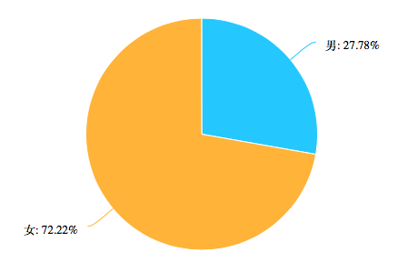
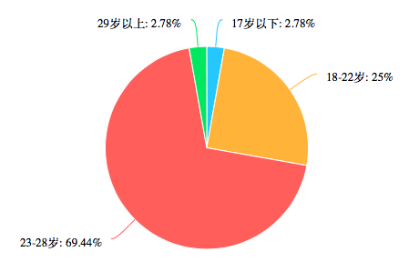
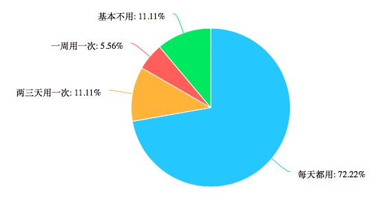
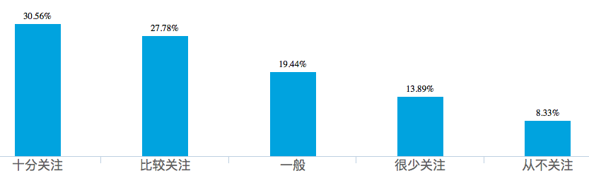
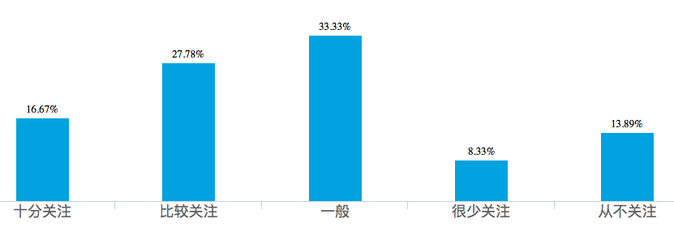
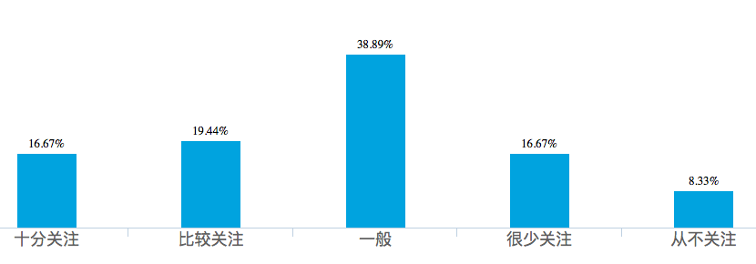
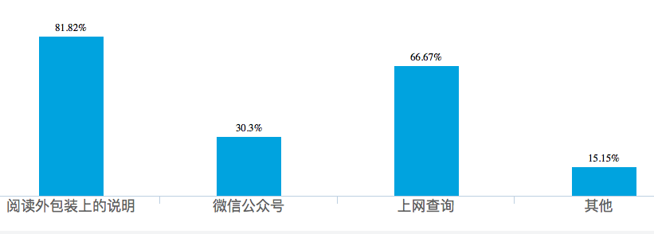
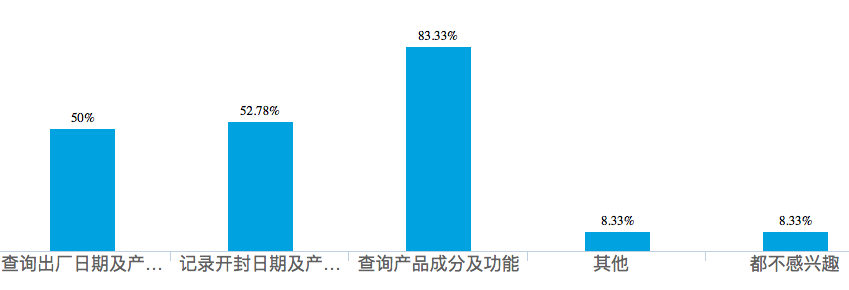

# Second Customer Validation

## Hypothesis
用户需要一个应用可以提供护肤品、化妆品相关的以下功能：
1. 查询产品的成分；
2. 查询产品的出厂日期及过期时间；
3. 记录产品的开封日期及过期时间。

**我们使用问卷来进行第二轮customer validation**

## Questionnaries

**本次问卷的有效填写人数为36人。**

1. 性别

2. 年龄

3. 您使用护肤品、化妆品的频率

4. 您是否关注您使用的护肤品、化妆品的保质期

5. 有些护肤品、化妆品开封之后有保质期，您是否关注这个开封保质期

6. 您是否关注您使用的护肤品、化妆品的成分

7. 您是通过什么途径来了解护肤品、化妆品的成分

8. 如果有一款应用可以提供以下护肤品、化妆品相关的功能，您对那些功能比较感兴趣？

## 问卷结果分析
这个问卷的调查人群大部分是年轻的女性。其中大部分的人每天都使用护肤品、化妆品。
另外，大部分的人都对产品的过期时间、成分感兴趣。所以我们的hythoposis是成立的。
其中，大部分的人还是通过阅读产品的外包装来获得信息的。
最后，超过一半的人都对出厂日期、过期日期和产品成分的查询功能感兴趣。其中，查询产品成分及功能是最受关注的。

